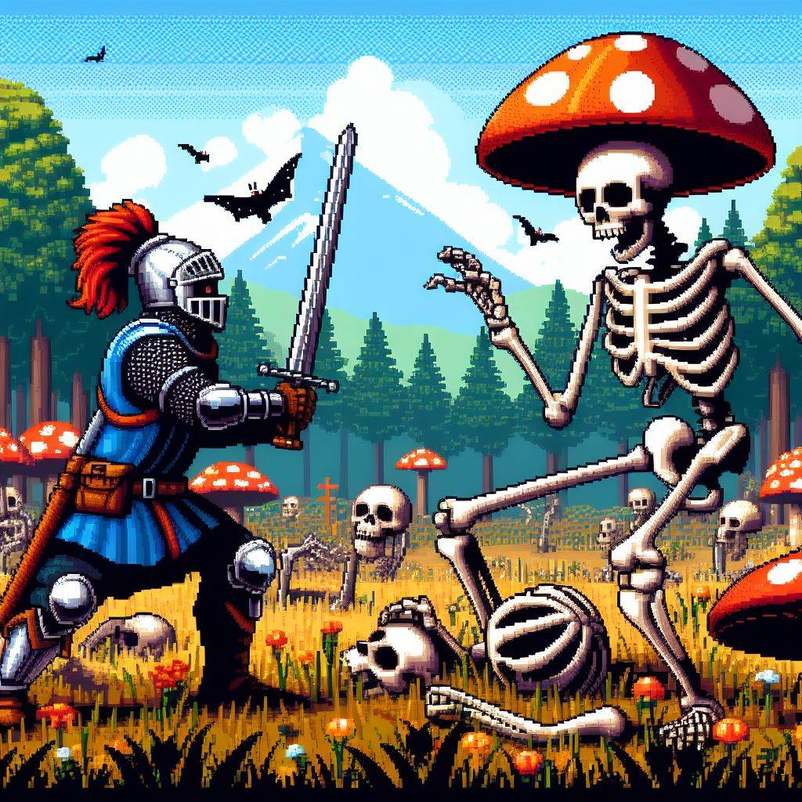

# GDD

## PRESENTACIÓN/RESUMEN

- **Título:** Galicia Run - Lugo's Fall
- **Concepto:** Eres un soldado de Ourense, tienes que derrotar a todos los lucenses que veas poseídos por el camino y derrotar al hongo invasor que controla Galicia
- **Género:** Violencia, Guerra, Obsceno
- **Público:** Galician Teenagers
- **Plataforma:** Windows or Linux

  

## GAMEPLAY

### Objetivos

El objetivo principal del juego es derrotar al hongo invasor que controla Galicia, enfrentándote a hordas de lucenses poseídos en el camino. Los objetivos secundarios pueden incluir los speedrun.

#### Jugabilidad

La jugabilidad se centra en la acción y el combate, donde el jugador utilizará diferentes habilidades para enfrentarse a enemigos variados. Se pueden incluir elementos de estrategia, como la planificación de rutas para maximizar el impacto enemigo.

### Progresión

La progresión del juego se divide en niveles, cada uno con su conjunto de desafíos y enemigos. A medida que el jugador avanza, puede desbloquear nuevas armas, habilidades y mejoras para enfrentar desafíos más difíciles. La historia se desarrolla a lo largo de la progresión, revelando más sobre el origen del hongo invasor.

### GUI

El GUI mostrará información vital.

## MECÁNICAS

- Reglas: El jugador gana al derrotar al hongo invasor y pierde si su salud llega a cero. El combate es esencial, pero también se puede los elementos de sigilo y estrategia.
- Interacción: Controles intuitivos para mover al personaje. Interacción con objetos del entorno para obtener recursos.
- Dificultad: Aumenta con la progresión, introduciendo enemigos más fuertes y desafíos más complejos.

## ELEMENTOS DEL VIDEOJUEGO

El juego se desarrolla en una Galicia invadida por un hongo lucense, transformando a los habitantes en criaturas hostiles. Los escenarios incluyen campos, bosques y áreas de guerra afectadas por la invasión. Se incorporan elementos de la cultura gallega en el diseño del mundo.

## ASSETS

- Música: Banda sonora épica que intensifica la experiencia del juego, con tonos gallegos.
- Modelos 2D: Arte detallado de personajes, enemigos y entornos, capturando la esencia de Galicia y la invasión fungil.
